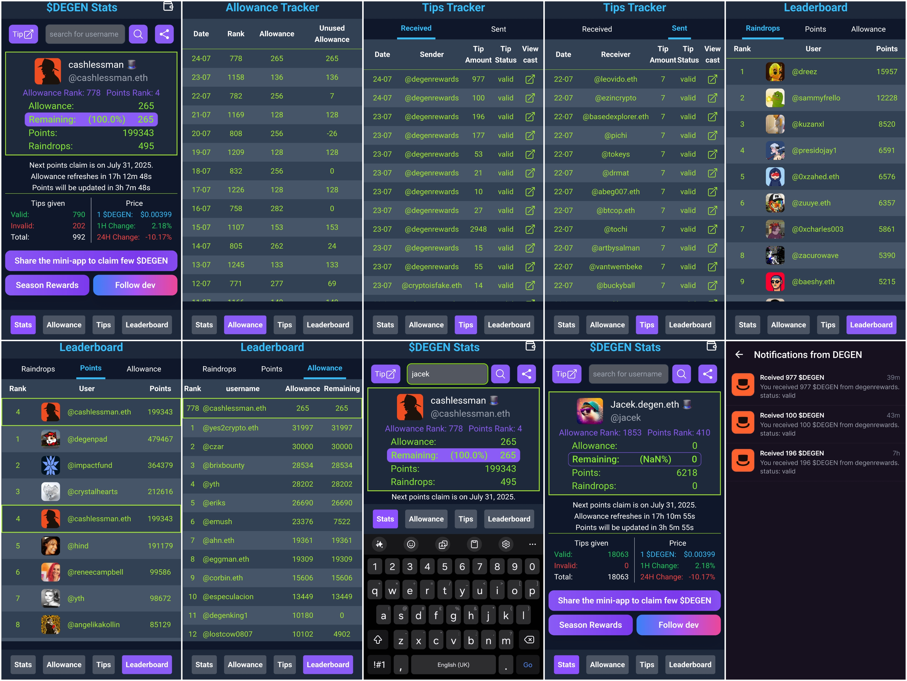

# 🚀 DEGEN – Farcaster Mini App

This is a **Mini App** built for [**Farcaster**](https://farcaster.xyz), a decentralized social media protocol to Ttack daily **$DEGEN Tipping** activities in one place.

The app provides a comprehensive interface for **DEGEN tipping**, displaying essential information and interactions in a user-friendly format.

🔗 Learn more about DEGEN on the official [website](https://www.degen.tips).


## Features

- **All-in-one dashboard:** See your current day stats, track your tip allowance, track tips received & sent and explore leaderboards.
- Know **today’s allowance** and **what’s left** at a glance so you can plan tipping precisely.
- View Total **Tips($DEGEN)** received.
- Know **Total Tips** given(valid & invalid).
- **Search** any user's stats to verify activity.
- Built-in **live $DEGEN price** (spot, 1h, 24h).
- View your **daily allowance history** from the start of the season.
- Verify **who tipped you**, **who you tipped** with amounts, valid/invalid status and a link to the cast.
- **Leaderboards** (Allowance, Points & Raindrops)**:** See top users with highest Allowance and Points
- **Notifications** ping you when your allowance updates and when you tip or receive a tip.
---


## 🛠️ Tech Stack

- [Next.js](https://nextjs.org/)
- [React](https://reactjs.org/)
- [TypeScript](https://www.typescriptlang.org/)
- [Tailwind CSS](https://tailwindcss.com/)


## 📦 Getting Started

Follow these steps to set up the project locally:

### 1. Clone the Repository

```bash
git clone https://github.com/sah-ban/degen
cd degen
```

### 2. Install Dependencies

```bash
yarn install
```

### 3. Configure Environment Variables

- Rename the example environment file:

```bash
mv example.env .env
```

- Generate a secure secret for `NEXTAUTH_SECRET`:

```bash
node -e "console.log(require('crypto').randomBytes(32).toString('hex'))"
```

- Replace the placeholder in `.env` with the generated value.

---

## 💻 Run the Development Server

```bash
yarn dev
```

The app will be available at `http://localhost:3000`.

---

## 🌐 Preview Locally with Ngrok

To test your app on Farcaster:

1. Start an ngrok tunnel:

```bash
ngrok http 3000
```

2. Copy the provided ngrok URL and open it in the [Farcaster Developer Tools](https://farcaster.xyz/~/developers/mini-apps/preview).

---

## 🧩 Customize the Mini App

Edit the main logic and UI in the following file:

```tsx
./src/components/Main.tsx
```

---

## 🚀 Deploying the App

### 1. Deploy to [Vercel](https://vercel.com/)

- Create a new project by importing your GitHub repository.
- During setup, add the following environment variable:

```
Key: NEXTAUTH_SECRET
Value: <your-generated-secret>
```

- Click **Deploy**.

### 2. Post-Deployment Steps

- Go to your Vercel **Dashboard** and copy the live deployment URL.
- Navigate to **Settings > Environment Variables**, and add the remaining variables from your `.env` file.
- Save and redeploy if needed.

---

## 🔗 Link Your Farcaster Account

### 1. Register Your Domain

- Go to [Farcaster Developer Tools](https://farcaster.xyz/~/developers/mini-apps).
- Paste your Vercel deployment domain.
- Untick **Include Example Definition**.
- Copy the generated **Domain Manifest** (automatically copied to clipboard).

### 2. Update the Domain Manifest in the Project

- Open the following file:

```tsx
./src/app/.well-known/farcaster.json/route.ts
```

- Replace the `accountAssociation` object with the one from the manifest.
- Commit and push your changes to deploy them.

---

## ✅ You're All Set!

Your Farcaster Mini App for DEGEN tipping is now ready to go live 🚀

For questions, feel free to reach out or open an issue in the [GitHub repo](https://github.com/sah-ban/degen/issues).
